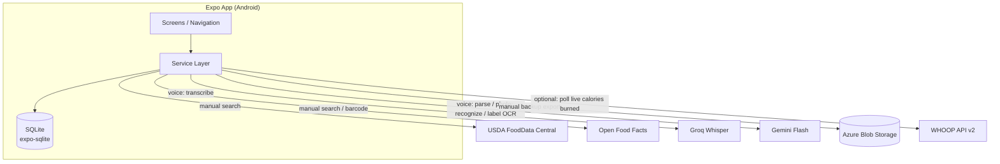
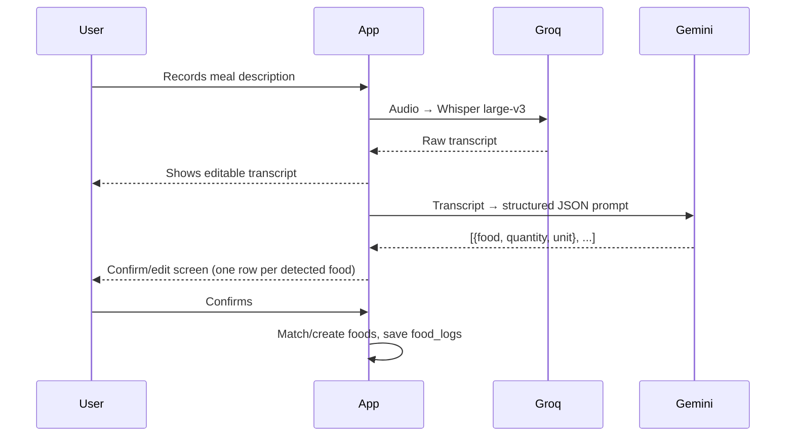
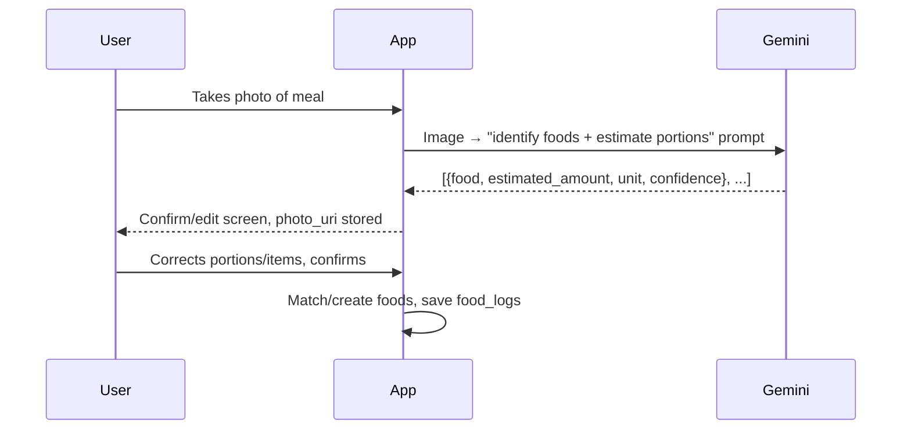
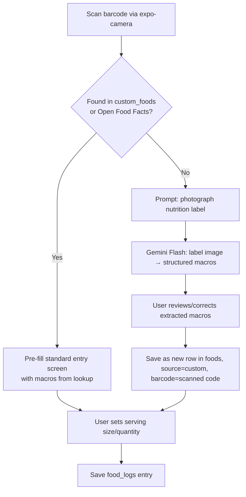

# AI Calorie Tracker — Project Plan

**Type:** Personal-use mobile app (sole user, Android, internal distribution)
**Status:** Pre-development — this document is the source of truth for scope and architecture.

---

## 1. Vision

A calorie/macro tracking app where logging food is fast regardless of context. Instead of forcing one input style, the user picks whichever is easiest in the moment:

1. **Manual search** — type a food name, pick from a database, set quantity.
2. **Voice** — describe the whole meal out loud; AI transcribes and parses it into structured entries.
3. **Photo** — snap the plate; AI recognizes food(s) and estimates portions, user corrects as needed.
4. **Barcode** — scan a packaged food; exact label macros are pulled automatically.

All four methods converge on the same underlying entry screen and the same data model — there is no "voice food" or "photo food," just food, logged four different ways.

## 2. Scope for v1

**In scope:**
- All four input methods above
- Two goal modes (user picks one):
  - **Fixed intake goal** — a daily calories-eaten target
  - **Deficit goal** — a daily target for (calories eaten − calories burned), tracked live as the day progresses; requires WHOOP connected
- Optional WHOOP account connection for automatic, live calories-burned data
- Macro breakdown (protein/carbs/fat)
- Meal categorization (breakfast/lunch/dinner/snack)
- Water logging
- Daily summary view + historical/trend views
- Local-first storage, manual/scheduled cloud backup (Azure Blob Storage)
- Android internal-distribution build via EAS

**Explicitly out of scope for v1** (revisit later):
- Habit learning (typical portion sizes, preferred ground beef leanness, "usual" defaults per food) — noted by the user as a good idea, deliberately deferred
- Multi-user support, auth, account system
- Multi-device real-time sync
- iOS build
- Contributing scanned barcode products back to Open Food Facts

## 3. Tech Stack

| Layer | Choice | Notes |
|---|---|---|
| Frontend | React Native + Expo (managed), TypeScript | EAS internal distribution for Android |
| Local storage | SQLite via `expo-sqlite` | Source of truth; app must be fully usable offline except for the AI-assisted entry methods |
| Barcode scanning | `expo-camera` built-in barcode scanning | `expo-barcode-scanner` is deprecated — do not use it |
| Generic/whole food database | USDA FoodData Central API | Free, requires a free API key from api.data.gov |
| Packaged/branded food database | Open Food Facts API | Free, no key required, barcode lookups |
| Speech-to-text | Groq API — Whisper large-v3 | Free tier, dedicated transcription only |
| Meal-description parsing | Google Gemini Flash API | Transcript → structured JSON (foods, quantities, units) |
| Photo food recognition | Google Gemini Flash API (multimodal) | Image → structured JSON (foods, estimated portions) |
| Nutrition label OCR fallback | Google Gemini Flash API (multimodal) | Used only when barcode lookup misses |
| Cloud backup | Azure Blob Storage | Personal-use scale only; not a live backend |
| Wearable integration (optional) | WHOOP API v2 (OAuth 2.0) | Free with a WHOOP account; provides live calories-burned data for the deficit goal mode |
| Backend server | **None** | App talks directly to USDA/OFF/Groq/Gemini/Azure Blob/WHOOP from the client |

### Why no backend server
Given this is a single, permanent user with no sync requirement and trivial data volume (see §7), a hosted API server would add real operational complexity (hosting, auth, deployment) for no corresponding benefit. Azure is used only as a backup target, not as compute.

One consequence worth flagging: WHOOP supports webhooks for near-real-time updates, but webhooks need a public HTTPS endpoint to receive them — which a no-backend app doesn't have. So WHOOP data is fetched by **polling** (on app open/foreground and on manual refresh of the Today screen) rather than pushed. See §6.5.

### A note on API keys in the client
Because there's no backend, API keys (Groq, Gemini, USDA) will be bundled into the app binary via Expo's `EXPO_PUBLIC_*` env vars. This is a real tradeoff — keys are extractable from the built app. It's acceptable here because:
- The app is never distributed publicly (internal EAS distribution only)
- All services used are free-tier with no payment method attached
- Worst case of key leakage is free-tier rate-limit abuse, not a billing event

If this app ever moves beyond personal use, this is the first thing to change (add a thin backend to proxy AI calls and hide keys).

## 4. Architecture

## 5. Data Model (SQLite)

All tables live in a single local SQLite database. Timestamps are ISO 8601 strings unless noted.

### `foods` — cached reference foods (from any source)
| Column | Type | Notes |
|---|---|---|
| id | TEXT PK (uuid) | |
| source | TEXT | `usda` \| `off` \| `custom` |
| source_id | TEXT nullable | USDA `fdcId` or OFF barcode, if applicable |
| barcode | TEXT nullable, indexed | for barcode lookups |
| name | TEXT | |
| brand | TEXT nullable | |
| reference_amount | REAL | e.g. 100 |
| reference_unit | TEXT | `g` \| `ml` \| `oz` \| `each` |
| calories | REAL | per reference_amount |
| protein_g | REAL | |
| carbs_g | REAL | |
| fat_g | REAL | |
| fiber_g | REAL nullable | |
| sugar_g | REAL nullable | |
| sodium_mg | REAL nullable | |
| created_at | TEXT | |
| last_used_at | TEXT nullable | for "recent foods" sorting |

### `food_logs` — diary entries
| Column | Type | Notes |
|---|---|---|
| id | TEXT PK (uuid) | |
| food_id | TEXT FK → foods.id | |
| logged_at | TEXT | date+time of the log |
| meal_type | TEXT | `breakfast` \| `lunch` \| `dinner` \| `snack` |
| quantity_amount | REAL | user-entered amount |
| quantity_unit | TEXT | matches or converts from food's reference_unit |
| calories | REAL | **snapshot**, computed at log time |
| protein_g | REAL | snapshot |
| carbs_g | REAL | snapshot |
| fat_g | REAL | snapshot |
| input_method | TEXT | `manual` \| `voice` \| `photo` \| `barcode` |
| photo_uri | TEXT nullable | local file path, if photo-based |
| raw_transcript | TEXT nullable | original speech transcript, if voice-based (debugging/audit) |
| created_at | TEXT | |

> Macros are snapshotted at log time (not recomputed from `foods` live) so editing a cached food later doesn't retroactively rewrite history.

### `water_logs`
| Column | Type |
|---|---|
| id | TEXT PK |
| logged_at | TEXT |
| amount_ml | REAL |

### `user_settings`
| Column | Type | Notes |
|---|---|---|
| id | INTEGER PK | single row, id=1 |
| goal_mode | TEXT | `fixed_intake` \| `deficit` |
| calorie_goal | REAL nullable | used when goal_mode = `fixed_intake` |
| deficit_goal_kcal | REAL nullable | used when goal_mode = `deficit`, e.g. 500 |
| protein_goal_g | REAL nullable | |
| carbs_goal_g | REAL nullable | |
| fat_goal_g | REAL nullable | |
| water_goal_ml | REAL | |
| updated_at | TEXT | |

> `deficit` mode requires a WHOOP connection (see §6.5). If the user selects it without one connected, the Settings screen should prompt them to connect WHOOP first rather than silently falling back.

### `whoop_connection` — single row, holds connection status only
| Column | Type | Notes |
|---|---|---|
| id | INTEGER PK | single row, id=1 |
| connected | INTEGER (bool) | |
| whoop_user_id | TEXT nullable | |
| token_expires_at | TEXT nullable | |
| last_synced_at | TEXT nullable | |

> Actual OAuth **access/refresh tokens are NOT stored here** — put them in `expo-secure-store` (Keychain/Keystore-backed), not plain SQLite, since they're live account credentials. This table just tracks connection state for UI purposes.

### `whoop_cycle_cache` — last-known calories-burned per day, for offline fallback + Trends
| Column | Type | Notes |
|---|---|---|
| id | TEXT PK | |
| cycle_date | TEXT | the day this cycle corresponds to |
| kilojoules | REAL | raw value from WHOOP |
| calories_burned | REAL | `kilojoules / 4.184`, precomputed for convenience |
| fetched_at | TEXT | |

### `backup_log`
| Column | Type | Notes |
|---|---|---|
| id | TEXT PK | |
| backed_up_at | TEXT | |
| blob_path | TEXT | |
| status | TEXT | `success` \| `failed` |

## 6. Input Methods & Live Data Pipelines

### 6.1 Manual entry
1. User types a search query
2. Query USDA FDC + Open Food Facts in parallel (Open Food Facts weighted toward branded/packaged hits, USDA toward generic foods)
3. Merge/dedupe results, display list
4. User selects a food → cache it into `foods` if not already cached → entry screen (quantity, meal type) → save to `food_logs`

### 6.2 Voice entry

Key point: the transcript is shown and editable **before** parsing, so STT errors are catchable independently of parsing errors.

### 6.3 Photo entry

### 6.4 Barcode entry

Future foods with the same barcode check `custom_foods`-tagged rows in `foods` first, then Open Food Facts, then a fresh USDA name search.

### 6.5 WHOOP Integration (Optional) — Automatic Calories Burned

Connected from Settings, entirely optional. Uses WHOOP's official public API (`developer.whoop.com`, base URL `api.prod.whoop.com`), **not** any reverse-engineered/internal endpoint — those aren't stable or sanctioned for third-party use.

**Auth:**
- OAuth 2.0 authorization code flow via `expo-auth-session`. Register the app on the WHOOP developer dashboard to get a `client_id`/`client_secret` and set a redirect URI (a custom URI scheme in `app.json`, e.g. `caloriemate://whoop-callback`).
- Minimum scope needed: `read:cycles`.
- Access/refresh tokens stored in `expo-secure-store`, never in SQLite (see §5). Same embedded-secret tradeoff already accepted for the AI API keys applies to `client_secret` here — acceptable for the same reasons (internal distribution, free tier, no billing exposure).

**Fetching burned calories:**
- Call the Cycle Collection endpoint sorted descending by start time, `limit=1`, to get the current/most recent physiological cycle.
- Read `score.kilojoule` from that cycle and convert: `calories_burned = kilojoules / 4.184`.
- Cache the result in `whoop_cycle_cache` so the Today screen has a value to show even if offline or rate-limited, and so Trends can chart burned-vs-eaten over time.

**"Live" caveat worth knowing up front:** WHOOP is a daily-cadence data source, not a real-time stream — the current cycle's `kilojoule` value is a running total that updates periodically (not continuously) and only finalizes once the cycle ends. Poll on Today-screen focus/foreground and on manual pull-to-refresh; don't build any expectation of push updates without a backend to receive WHOOP's webhooks (see §3, "Why no backend server").

### 6.6 Goal Modes & Live Deficit Tracking

Two modes, set in Settings, stored in `user_settings.goal_mode`:

**a) Fixed intake** — a straightforward calories-eaten-per-day target. Today screen shows a ring: eaten vs. `calorie_goal`.

**b) Deficit** — the user sets a target daily deficit (`deficit_goal_kcal`, e.g. 500). The app tracks, live, throughout the day:
- **Eaten** — sum of today's `food_logs.calories`
- **Burned** — latest value from `whoop_cycle_cache` (refreshed per §6.5)
- **Net** — eaten − burned
- **Target net** — `-deficit_goal_kcal`

**Design decision worth calling out:** the Today screen shows eaten/burned/net/target-net as plain numbers with a progress comparison, rather than collapsing them into a single "calories remaining today" figure. A single remaining-budget number would require projecting the *rest of the day's* burn (e.g. from an estimated TDEE or a rolling average), which is a real modeling assumption with its own error bars — not something to quietly bake in. Showing the raw components keeps the number honest at every point in the day, including early morning when burned-so-far is naturally small. This can be revisited later if a projected-remaining view turns out to be worth the added assumption.

## 7. Storage Footprint (sanity check)

The food database is **never mirrored locally in bulk** — only foods actually looked up or logged get cached. Rough estimate for one year of realistic personal use:

| Data | Volume/year | Est. size |
|---|---|---|
| Cached foods (`foods`) | ~800–1,500 rows | ~1 MB |
| Food logs | ~2,200 rows | ~0.7 MB |
| Water logs | ~1,500 rows | ~0.1 MB |
| **Structured data total** | | **~1–2 MB/year** |
| Meal photos (if retained, ~300 KB avg, ~1–2/day) | ~500 photos | ~100–250 MB/year |

Voice recordings are **not persisted** — only the transcript is kept (in `food_logs.raw_transcript`), audio is discarded after transcription. Structured data stays trivially small indefinitely; photos are the only meaningfully-sized asset, and still nowhere near a storage concern on-device or in Blob Storage.

## 8. Backup Strategy

- No live backend — backup is a **manual/scheduled export**, not continuous sync.
- Export = copy the SQLite DB file (+ referenced photos, optionally) and upload to an Azure Blob Storage container using a long-lived SAS (Shared Access Signature) URL generated once via the Azure Portal/CLI — this avoids pulling in the full Azure Storage SDK (which has Node-specific dependencies not well suited to the Expo/React Native runtime). A simple authenticated `fetch` PUT to the SAS URL is sufficient.
- Trigger: a manual "Back up now" button in Settings for v1. A scheduled background task (`expo-background-task` or similar) can be added later if desired.
- Each backup logs a row to `backup_log`.

## 9. Screens / Navigation Map

- **Today** (home): goal-mode-dependent header — either a calorie ring (fixed intake) or eaten/burned/net vs. target-net (deficit mode, live via WHOOP) — plus macro breakdown, meals list (breakfast/lunch/dinner/snacks), water tracker, floating "add" button → method picker (manual/voice/photo/barcode)
- **Add — Manual**: search → results list → entry form (quantity, meal type)
- **Add — Voice**: record → transcript review → parsed items confirm screen
- **Add — Photo**: camera → recognized items confirm screen
- **Add — Barcode**: scanner → lookup result (or label-photo fallback) → entry form
- **History**: calendar/list of past days, tap a day → that day's full log
- **Trends**: calorie/macro charts over time (week/month view)
- **Settings**: goal mode toggle (fixed intake / deficit) + corresponding goal input, macro/water goals, WHOOP connect/disconnect, backup now, app info

## 10. Build Phases

Each phase should end in something runnable/testable before moving to the next.

| Phase | Deliverable |
|---|---|
| 0 | Expo + TypeScript scaffolding, navigation shell, folder structure, env var setup, git init |
| 1 | SQLite schema + typed data access layer + migrations, default settings seeded |
| 2 | Manual entry loop end-to-end (search → log → Today screen shows real data) |
| 3 | Water logging + Settings/goals screen |
| 4 | History + Trends views |
| 5 | Voice entry pipeline (Groq + Gemini) |
| 6 | Photo entry pipeline (Gemini) |
| 7 | Barcode entry pipeline (Open Food Facts + label-photo fallback) |
| 8 | WHOOP integration (OAuth connect, cycle polling) + deficit goal mode on Today screen |
| 9 | Azure Blob backup |
| 10 | Polish (empty states, error handling), EAS internal distribution build |

## 11. Open Decisions Log

- **AI provider split**: Groq Whisper for transcription only; Gemini Flash for all "understanding" tasks (parsing, photo recognition, label OCR). Chosen for Whisper's dedicated transcription quality + a debuggable/editable transcript step, while keeping the rest consolidated on one provider.
- **Barcode misses**: fall back to photographing the nutrition label and using Gemini vision to extract macros, rather than pure manual typing. New foods get saved locally (`foods` table, `source=custom`) rather than contributed back to Open Food Facts.
- **Storage**: local SQLite is the source of truth; Azure is backup-only, not a live backend, given trivial data volume and single permanent user.
- **No auth/accounts**: not needed for a permanent single-user personal app.
- **WHOOP: polling, not webhooks**: since there's no backend to receive them, WHOOP webhooks are skipped in favor of polling the Cycle Collection endpoint on Today-screen focus/refresh. Official public API only — no reverse-engineered endpoints.
- **Deficit-mode display**: show eaten/burned/net/target-net as plain numbers rather than a single projected "calories remaining today," to avoid silently baking in a TDEE-projection assumption. Revisit if a projected-remaining view proves worth the tradeoff.
