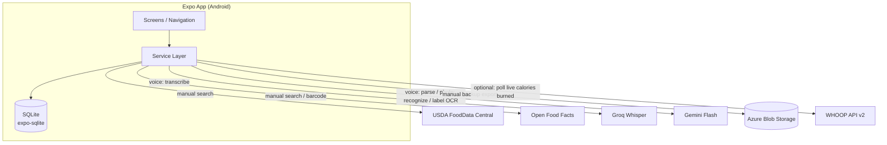
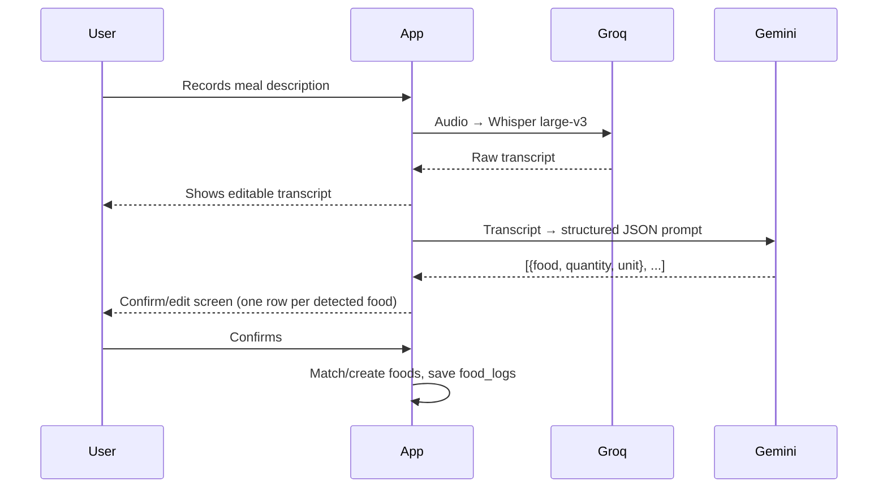
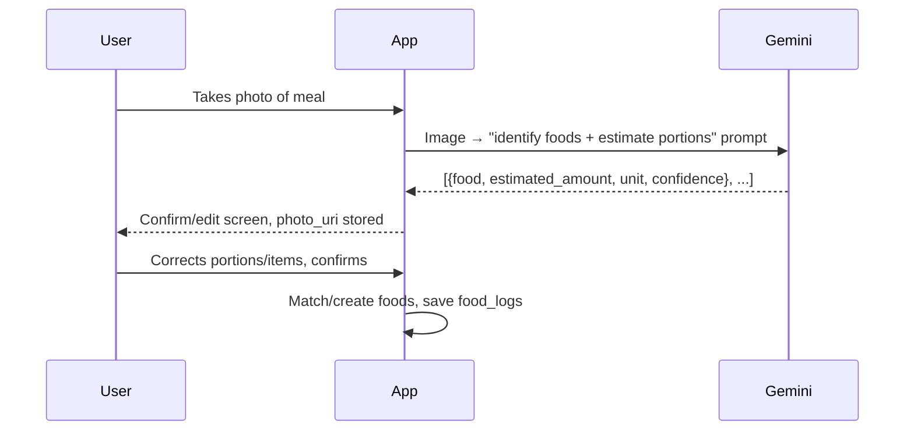
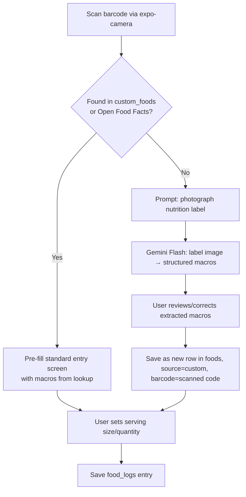

# AI Calorie Tracker — Project Plan

**Type:** Personal-use mobile app (sole user, Android, internal distribution)
**Status:** Pre-development — this document is the source of truth for scope and architecture.

---

## 1. Vision

A calorie/macro tracking app where logging food is fast regardless of context. Instead of forcing one input style, the user picks whichever is easiest in the moment:

1. **Manual search** — type a food name, pick from a database, set quantity.
2. **Voice** — describe the whole meal out loud; AI transcribes and parses it into structured entries.
3. **Photo** — snap the plate; AI recognizes food(s) and estimates portions, user corrects as needed.
4. **Barcode** — scan a packaged food; exact label macros are pulled automatically.

All four methods converge on the same underlying entry screen and the same data model — there is no "voice food" or "photo food," just food, logged four different ways.

## 2. Scope for v1

**In scope:**
- All four input methods above
- Two goal modes (user picks one):
  - **Fixed intake goal** — a daily calories-eaten target
  - **Deficit goal** — a daily target for (calories eaten − calories burned), tracked live as the day progresses; requires WHOOP connected
- Optional WHOOP account connection for automatic, live calories-burned data
- Macro breakdown (protein/carbs/fat)
- Meal categorization (breakfast/lunch/dinner/snack)
- Recipes — user-created combinations of multiple ingredients, logged as a single unit (see §5, §11)
- Daily summary view + historical/trend views
- Local-first storage, manual/scheduled cloud backup (Azure Blob Storage)
- Android internal-distribution build via EAS

**Explicitly out of scope for v1** (revisit later):
- Habit learning (typical portion sizes, preferred ground beef leanness, "usual" defaults per food) — noted by the user as a good idea, deliberately deferred
- Water logging — was built and shipped in an earlier iteration, then deliberately dropped per user feedback (not useful enough to keep). The `water_logs` table stays in the schema (harmless, matches historical data if any exists) but water logging is no longer a v1 deliverable. See §11.
- Multi-user support, auth, account system
- Multi-device real-time sync
- iOS build
- Contributing scanned barcode products back to Open Food Facts

## 3. Tech Stack

| Layer | Choice | Notes |
|---|---|---|
| Frontend | React Native + Expo (managed), TypeScript | EAS internal distribution for Android |
| Local storage | SQLite via `expo-sqlite` | Source of truth; app must be fully usable offline except for the AI-assisted entry methods |
| Barcode scanning | `expo-camera` built-in barcode scanning | `expo-barcode-scanner` is deprecated — do not use it |
| Generic/whole food database | USDA FoodData Central API | Free, requires a free API key from api.data.gov |
| Packaged/branded food database | Open Food Facts API | Free, no key required, barcode lookups |
| Speech-to-text | Groq API — Whisper large-v3-turbo | Free tier, dedicated transcription only. Turbo over plain large-v3 for latency on short clips — see §11 |
| Meal-description parsing | Google Gemini Flash API | Transcript → structured JSON (foods, quantities, units) |
| Photo food recognition | Google Gemini Flash API (multimodal) | Image → structured JSON (foods, estimated portions) |
| Nutrition label OCR fallback | Google Gemini Flash API (multimodal) | Used only when barcode lookup misses |
| Cloud backup | Azure Blob Storage | Personal-use scale only; not a live backend |
| Wearable integration (optional) | WHOOP API v2 (OAuth 2.0) | Free with a WHOOP account; provides live calories-burned data for the deficit goal mode |
| Backend server | **None** | App talks directly to USDA/OFF/Groq/Gemini/Azure Blob/WHOOP from the client |

### Why no backend server
Given this is a single, permanent user with no sync requirement and trivial data volume (see §7), a hosted API server would add real operational complexity (hosting, auth, deployment) for no corresponding benefit. Azure is used only as a backup target, not as compute.

One consequence worth flagging: WHOOP supports webhooks for near-real-time updates, but webhooks need a public HTTPS endpoint to receive them — which a no-backend app doesn't have. So WHOOP data is fetched by **polling** (on app open/foreground and on manual refresh of the Today screen) rather than pushed. See §6.5.

### A note on API keys in the client
Because there's no backend, API keys (Groq, Gemini, USDA) will be bundled into the app binary via Expo's `EXPO_PUBLIC_*` env vars. This is a real tradeoff — keys are extractable from the built app. It's acceptable here because:
- The app is never distributed publicly (internal EAS distribution only)
- All services used are free-tier with no payment method attached
- Worst case of key leakage is free-tier rate-limit abuse, not a billing event

If this app ever moves beyond personal use, this is the first thing to change (add a thin backend to proxy AI calls and hide keys).

## 4. Architecture

## 5. Data Model (SQLite)

All tables live in a single local SQLite database. Timestamps are ISO 8601 strings unless noted.

### `foods` — cached reference foods (from any source)
| Column | Type | Notes |
|---|---|---|
| id | TEXT PK (uuid) | |
| source | TEXT | `usda` \| `off` \| `custom` \| `recipe` |
| source_id | TEXT nullable | USDA `fdcId` or OFF barcode, if applicable |
| barcode | TEXT nullable, indexed | for barcode lookups |
| name | TEXT | |
| brand | TEXT nullable | |
| reference_amount | REAL | e.g. 100 |
| reference_unit | TEXT | `g` \| `ml` \| `oz` \| `each` |
| calories | REAL | per reference_amount |
| protein_g | REAL | |
| carbs_g | REAL | |
| fat_g | REAL | |
| fiber_g | REAL nullable | |
| sugar_g | REAL nullable | |
| sodium_mg | REAL nullable | |
| created_at | TEXT | |
| last_used_at | TEXT nullable | for "recent foods" sorting |

### `food_logs` — diary entries
| Column | Type | Notes |
|---|---|---|
| id | TEXT PK (uuid) | |
| food_id | TEXT FK → foods.id | |
| logged_at | TEXT | date+time of the log |
| meal_type | TEXT | `breakfast` \| `lunch` \| `dinner` \| `snack` |
| quantity_amount | REAL | user-entered amount |
| quantity_unit | TEXT | matches or converts from food's reference_unit |
| calories | REAL | **snapshot**, computed at log time |
| protein_g | REAL | snapshot |
| carbs_g | REAL | snapshot |
| fat_g | REAL | snapshot |
| input_method | TEXT | `manual` \| `voice` \| `photo` \| `barcode` |
| photo_uri | TEXT nullable | local file path, if photo-based |
| raw_transcript | TEXT nullable | original speech transcript, if voice-based (debugging/audit) |
| created_at | TEXT | |

> Macros are snapshotted at log time (not recomputed from `foods` live) so editing a cached food later doesn't retroactively rewrite history.

### `recipes` — user-created combinations of multiple ingredients
| Column | Type | Notes |
|---|---|---|
| id | TEXT PK (uuid) | |
| name | TEXT | |
| created_at | TEXT | |
| last_used_at | TEXT nullable | for recents sorting, same convention as `foods` |

### `recipe_ingredients` — line items belonging to a recipe
| Column | Type | Notes |
|---|---|---|
| id | TEXT PK (uuid) | |
| recipe_id | TEXT FK → recipes.id | |
| food_id | TEXT FK → foods.id | ingredients are individual foods only — no nesting recipes inside recipes |
| quantity_amount | REAL | |
| quantity_unit | TEXT | matches the ingredient food's `reference_unit`, same simplification as `food_logs.quantity_unit` |
| sort_order | INTEGER | preserves the order ingredients were added |

> A recipe's total macros are **not** stored — they're computed live by joining `recipe_ingredients` → `foods` and summing each line's scaled macros, so editing a recipe's ingredients is immediately reflected. Logging a recipe works through the same `foods` → `food_logs` pipeline as any other food: at log time, the recipe's current totals are upserted into a `foods` row (`source='recipe'`, `source_id=recipes.id`, `reference_amount=1`, `reference_unit='each'` — quantity logged is servings/fraction of the batch), then a normal `food_logs` snapshot is created from that. This means past logs stay correct even if the recipe is edited later (same snapshot guarantee as any other food), while the cached `foods` row for a recipe is refreshed — not treated as immutable — each time it's logged, since (unlike a USDA/OFF food) its own definition can change.

### `water_logs`
> Retained in the schema but **not part of v1 scope** — water logging was built, then descoped. See §2, §11.

| Column | Type |
|---|---|
| id | TEXT PK |
| logged_at | TEXT |
| amount_ml | REAL |

### `weight_logs`
| Column | Type | Notes |
|---|---|---|
| id | TEXT PK | |
| logged_at | TEXT | |
| weight_lbs | REAL | pounds — this is a single US-based user's app; see §11 |

> Chart data (Progress → Trends) uses one point per day; if multiple entries exist for the same day, the most recent is used.

### `user_settings`
| Column | Type | Notes |
|---|---|---|
| id | INTEGER PK | single row, id=1 |
| goal_mode | TEXT | `fixed_intake` \| `deficit` |
| calorie_goal | REAL nullable | used when goal_mode = `fixed_intake` |
| deficit_goal_kcal | REAL nullable | used when goal_mode = `deficit`, e.g. 500 |
| protein_goal_g | REAL nullable | |
| carbs_goal_g | REAL nullable | |
| fat_goal_g | REAL nullable | |
| water_goal_ml | REAL | |
| updated_at | TEXT | |

> `deficit` mode requires a WHOOP connection (see §6.5). If the user selects it without one connected, the Settings screen should prompt them to connect WHOOP first rather than silently falling back.

### `whoop_connection` — single row, holds connection status only
| Column | Type | Notes |
|---|---|---|
| id | INTEGER PK | single row, id=1 |
| connected | INTEGER (bool) | |
| whoop_user_id | TEXT nullable | |
| token_expires_at | TEXT nullable | |
| last_synced_at | TEXT nullable | |

> Actual OAuth **access/refresh tokens are NOT stored here** — put them in `expo-secure-store` (Keychain/Keystore-backed), not plain SQLite, since they're live account credentials. This table just tracks connection state for UI purposes.

### `whoop_cycle_cache` — last-known calories-burned per day, for offline fallback + Trends
| Column | Type | Notes |
|---|---|---|
| id | TEXT PK | |
| cycle_date | TEXT | the day this cycle corresponds to |
| kilojoules | REAL | raw value from WHOOP |
| calories_burned | REAL | `kilojoules / 4.184`, precomputed for convenience |
| fetched_at | TEXT | |

### `backup_log`
| Column | Type | Notes |
|---|---|---|
| id | TEXT PK | |
| backed_up_at | TEXT | |
| blob_path | TEXT | |
| status | TEXT | `success` \| `failed` |

## 6. Input Methods & Live Data Pipelines

### 6.1 Manual entry
1. User types a search query
2. Query USDA FDC + Open Food Facts in parallel (Open Food Facts weighted toward branded/packaged hits, USDA toward generic foods)
3. Merge/dedupe results, display list
4. User selects a food → cache it into `foods` if not already cached → entry screen (quantity, meal type) → save to `food_logs`

### 6.2 Voice entry

Key point: the transcript is shown and editable **before** parsing, so STT errors are catchable independently of parsing errors.

### 6.3 Photo entry

### 6.4 Barcode entry

Future foods with the same barcode check `custom_foods`-tagged rows in `foods` first, then Open Food Facts, then a fresh USDA name search.

### 6.5 WHOOP Integration (Optional) — Automatic Calories Burned

Connected from Settings, entirely optional. Uses WHOOP's official public API (`developer.whoop.com`, base URL `api.prod.whoop.com`), **not** any reverse-engineered/internal endpoint — those aren't stable or sanctioned for third-party use.

**Auth:**
- OAuth 2.0 authorization code flow via `expo-auth-session`. Register the app on the WHOOP developer dashboard to get a `client_id`/`client_secret` and set a redirect URI (a custom URI scheme in `app.json`, e.g. `caloriemate://whoop-callback`).
- Minimum scope needed: `read:cycles`.
- Access/refresh tokens stored in `expo-secure-store`, never in SQLite (see §5). Same embedded-secret tradeoff already accepted for the AI API keys applies to `client_secret` here — acceptable for the same reasons (internal distribution, free tier, no billing exposure).

**Fetching burned calories:**
- Call the Cycle Collection endpoint sorted descending by start time, `limit=1`, to get the current/most recent physiological cycle.
- Read `score.kilojoule` from that cycle and convert: `calories_burned = kilojoules / 4.184`.
- Cache the result in `whoop_cycle_cache` so the Today screen has a value to show even if offline or rate-limited, and so Trends can chart burned-vs-eaten over time.

**"Live" caveat worth knowing up front:** WHOOP is a daily-cadence data source, not a real-time stream — the current cycle's `kilojoule` value is a running total that updates periodically (not continuously) and only finalizes once the cycle ends. Poll on Today-screen focus/foreground and on manual pull-to-refresh; don't build any expectation of push updates without a backend to receive WHOOP's webhooks (see §3, "Why no backend server").

### 6.6 Goal Modes & Live Deficit Tracking

Two modes, set in Settings, stored in `user_settings.goal_mode`:

**a) Fixed intake** — a straightforward calories-eaten-per-day target. Today screen shows a ring: eaten vs. `calorie_goal`.

**b) Deficit** — the user sets a target daily deficit (`deficit_goal_kcal`, e.g. 500). The app tracks, live, throughout the day:
- **Eaten** — sum of today's `food_logs.calories`
- **Burned** — latest value from `whoop_cycle_cache` (refreshed per §6.5)
- **Net** — eaten − burned
- **Target net** — `-deficit_goal_kcal`

**Design decision worth calling out:** the Today screen shows eaten/burned/net/target-net as plain numbers with a progress comparison, rather than collapsing them into a single "calories remaining today" figure. A single remaining-budget number would require projecting the *rest of the day's* burn (e.g. from an estimated TDEE or a rolling average), which is a real modeling assumption with its own error bars — not something to quietly bake in. Showing the raw components keeps the number honest at every point in the day, including early morning when burned-so-far is naturally small. This can be revisited later if a projected-remaining view turns out to be worth the added assumption.

## 7. Storage Footprint (sanity check)

The food database is **never mirrored locally in bulk** — only foods actually looked up or logged get cached. Rough estimate for one year of realistic personal use:

| Data | Volume/year | Est. size |
|---|---|---|
| Cached foods (`foods`) | ~800–1,500 rows | ~1 MB |
| Food logs | ~2,200 rows | ~0.7 MB |
| Water logs | ~1,500 rows | ~0.1 MB |
| Weight logs | ~365 rows | <0.1 MB |
| **Structured data total** | | **~1–2 MB/year** |
| Meal photos (if retained, ~300 KB avg, ~1–2/day) | ~500 photos | ~100–250 MB/year |

Voice recordings are **not persisted** — only the transcript is kept (in `food_logs.raw_transcript`), audio is discarded after transcription. Structured data stays trivially small indefinitely; photos are the only meaningfully-sized asset, and still nowhere near a storage concern on-device or in Blob Storage.

## 8. Backup Strategy

- No live backend — backup is a **manual/scheduled export**, not continuous sync.
- Export = copy the SQLite DB file (+ referenced photos, optionally) and upload to an Azure Blob Storage container using a long-lived SAS (Shared Access Signature) URL generated once via the Azure Portal/CLI — this avoids pulling in the full Azure Storage SDK (which has Node-specific dependencies not well suited to the Expo/React Native runtime). A simple authenticated `fetch` PUT to the SAS URL is sufficient.
- Trigger: a manual "Back up now" button in Settings for v1. A scheduled background task (`expo-background-task` or similar) can be added later if desired.
- Each backup logs a row to `backup_log`.

## 9. Screens / Navigation Map

- **Today** (home): goal-mode-dependent header — either a calorie ring (fixed intake) or eaten/burned/net vs. target-net (deficit mode, live via WHOOP) — plus macro breakdown, meals list (breakfast/lunch/dinner/snacks), a week strip + calendar for jumping to any day (this doubles as day-browsing — see "History" note below), floating "add" button → method picker (manual/voice/photo/barcode)
- **Add — Manual**: search → results list (All / My Recipes / My Foods) → entry form (quantity, meal type)
- **Add — Voice**: record → transcript review → **shared Review Meal screen**
- **Add — Photo**: camera or photo library → **shared Review Meal screen**
- **Review Meal** (shared by voice + photo): item list with inline quantity editing, low-confidence flags, per-item tap-through, and "add another food". **Edit Item** (tap-through): suggested alternatives (model runner-ups + next-best database matches), amount/unit controls, and full search
- **Add — Barcode**: scanner → lookup result (or label-photo fallback) → entry form
- **Progress** (formerly split into History + Trends): History was dropped as a separate screen — Today's own date nav (week strip + calendar) already covers browsing any past day's full log, so a second calendar view would be redundant. Progress is Trends only: calorie chart (eaten-per-day, or deficit-per-day once WHOOP is connected) with time range toggle (week/month/3mo/6mo/all-time), weight overlaid as a secondary-axis line, and weight logging itself lives on this screen.
- **Settings**: goal mode toggle (fixed intake / deficit — deficit shown but disabled until WHOOP is connected), calorie + macro goal inputs, WHOOP connect/disconnect (disabled, Phase 8), backup now (disabled, Phase 9), app info

## 10. Build Phases

Each phase should end in something runnable/testable before moving to the next.

| Phase | Deliverable |
|---|---|
| 0 | Expo + TypeScript scaffolding, navigation shell, folder structure, env var setup, git init |
| 1 | SQLite schema + typed data access layer + migrations, default settings seeded |
| 2 | Manual entry loop end-to-end (search → log → Today screen shows real data) |
| 3 | Settings/goals screen (water logging dropped — see §11) |
| 4 | Trends view (History dropped — see §9) + weight logging |
| 5 | Voice entry pipeline (Groq + Gemini) |
| 6 | Photo entry pipeline (Gemini) |
| 7 | Barcode entry pipeline (Open Food Facts + label-photo fallback) |
| 8 | WHOOP integration (OAuth connect, cycle polling) + deficit goal mode on Today screen |
| 9 | Azure Blob backup |
| 10 | Polish (empty states, error handling), EAS internal distribution build |

## 11. Open Decisions Log

- **AI provider split**: Groq Whisper for transcription only; Gemini Flash for all "understanding" tasks (parsing, photo recognition, label OCR). Chosen for Whisper's dedicated transcription quality + a debuggable/editable transcript step, while keeping the rest consolidated on one provider.
- **Barcode misses**: fall back to photographing the nutrition label and using Gemini vision to extract macros, rather than pure manual typing. New foods get saved locally (`foods` table, `source=custom`) rather than contributed back to Open Food Facts.
- **Storage**: local SQLite is the source of truth; Azure is backup-only, not a live backend, given trivial data volume and single permanent user.
- **No auth/accounts**: not needed for a permanent single-user personal app.
- **WHOOP: polling, not webhooks**: since there's no backend to receive them, WHOOP webhooks are skipped in favor of polling the Cycle Collection endpoint on Today-screen focus/refresh. Official public API only — no reverse-engineered endpoints.
- **Deficit-mode display**: show eaten/burned/net/target-net as plain numbers rather than a single projected "calories remaining today," to avoid silently baking in a TDEE-projection assumption. Revisit if a projected-remaining view proves worth the tradeoff.
- **Water logging dropped**: built and shipped on the Today screen during Phase 2/3 UI work, then removed at the user's request ("pretty unnecessary... don't think it would be very useful"). `water_logs` stays in the schema (harmless) but is no longer a v1 deliverable.
- **Recipes added**: user-created multi-ingredient combinations, added mid-Phase-3 as a real feature (not originally in this plan). A recipe's macros are computed live from its ingredients rather than cached, and logging a recipe reuses the existing `foods` → `food_logs` pipeline via an upsert-on-log cache (see §5 for the full rationale). Ingredients can only be individual foods, not other recipes — no nesting.
- **Settings built ahead of its WHOOP/backup dependencies**: rather than waiting until Phases 8/9 to build any of Settings, the whole screen ships in Phase 3 — goal mode, calorie goal, and macro goals are fully functional now, while the deficit-mode option, WHOOP connect, and "Back up now" are visible but disabled with a "coming later" state. Chosen over leaving those sections out entirely, since a visibly-disabled control is a more honest signal than a screen that silently omits functionality described in §9.
- **History dropped, folded into Today**: a separate History screen (calendar → day detail) would have been redundant with Today's own week-strip + calendar date navigation, which already lets you view any day's full log in place. Progress is Trends-only.
- **Weight tracking added**: not originally in this plan. A new `weight_logs` table (see §5) backs a weight-logging UI on the Progress screen and a secondary-axis line on the Trends chart. Stored in pounds, matching this app's US-only context (USDA FDC, Azure region, Android-only distribution) — no unit-preference setting, since this is a single fixed user.
- **Charting library: `react-native-gifted-charts`**: chosen over heavier alternatives (e.g. Victory Native) since the charting need is narrow — one combo chart (calories as bars, weight as a secondary-axis line) rather than a general-purpose dashboard. Verified it genuinely supports both a secondary Y-axis (`secondaryYAxis`/`secondaryData`) and zero-centered/negative bars (`mostNegativeValue`, `noOfSectionsBelowXAxis`) before committing, since those are the two features the deficit-mode chart will depend on later. Depends on `react-native-svg` and accepts `expo-linear-gradient` (already installed) as its gradient peer — no new gradient library needed.
- **Deficit/surplus chart deferred**: the zero-centered diverging bar chart (surplus above a middle axis, deficit below) is designed for but not built until WHOOP (Phase 8) actually produces deficit data. It's also expected to be mutually exclusive with the weight secondary-axis overlay, since a zero-centered bar axis and a secondary value axis don't compose cleanly — to be resolved when Phase 8 lands.
- **Voice pipeline backend built (Phase 5)**: recording via `expo-audio` (`useAudioRecorder` + `RecordingPresets.HIGH_QUALITY`, verified against the installed package's own `.d.ts` files rather than docs, since SDK 54 replaced the old `expo-av` recording API). Transcription uses `whisper-large-v3-turbo` (not plain `large-v3` as originally written in §3) — chosen for latency on short single-speaker clips, where turbo's accuracy is essentially indistinguishable from the full model. Parsing uses Gemini via the classic `generateContent` + `generationConfig.responseSchema` REST shape, confirmed still functional by a real on-device request. Gemini is intentionally not asked for macros — parsed `{food, quantity, unit}` triples are matched against USDA/OFF via the existing search service, so logged macros always come from a real database, never an LLM guess. Recordings are deleted (`expo-file-system`'s `File.delete()`) immediately after transcription, per §7's "audio is not persisted" policy.
- **Food search relevance rebuilt (generic-first ranking)**: the original merge interleaved Open Food Facts first, so plain-food searches led with branded packages — searching "rice" returned distributor-labelled "RICE" products, and voice logging (which blindly takes the top hit) inherited the same problem. Three changes, each verified against the live APIs before committing: **(1)** USDA is now queried with `dataType: ["Foundation","SR Legacy","Survey (FNDDS)"]` and Branded is excluded entirely — OFF already covers packaged goods with better naming. This requires POST, since the GET endpoint 400s on the parentheses in `Survey (FNDDS)`. **(2)** Two pages are fetched, because USDA's own ordering correlates with description length rather than relevance and buries canonical entries — `Rice, cooked, NFS` sits on page 2 for the query "rice". (`pageSize` 30 verified working; 25 and 50 both returned gateway errors.) **(3)** Results are re-ranked client-side in `src/services/foodRanking.ts`, keying off USDA's `HeadNoun, qualifier, qualifier` naming convention: an entry whose head noun introduces no words the user didn't say *is* that food ("Rice, white, cooked"), while one that adds new head words is a different dish containing it ("Beans and white rice", "Crackers, rice"). Plus bonuses for FNDDS's `NFS` ("Not Further Specified") marker and plain preparations, which are the right defaults for a bare food name. The generic bonus is weighted at 200 because branded names are short marketing strings that pick up exact-head matches far too easily; validated that "cheerios" and "coca cola" still return their branded product on top.
- **Voice and photo converge on one shared review screen (Phase 6)**: rather than each AI flow owning its own confirm UI, both now end at `MealReviewScreen` — identical final page, per the user's request. Voice keeps its editable-transcript step and photo keeps its capture step, but from the moment an AI has named foods the two are the same code path. This is backed by `DraftItem`, one shape both pipelines produce (`src/services/mealDraftBuilder.ts` does the AI-name → database-match resolution for both), and `MealDraftContext`, a provider above the navigation stack. The context exists because the review screen and the per-item edit screen are separate routes operating on one list: React Navigation params are meant to be serializable, so passing food objects and mutation callbacks through them would be both lossy and fragile.
- **Item alternatives come from two sources**: the edit screen shows Gemini's own runner-up identifications (catches "that's turkey, not chicken") *and* the next-best ranked database matches (catches "ground beef 80/20 vs 90/10"). Neither costs an extra request — the vision model returns alternatives in the same call, and the ranked candidate list is already computed during matching. Gemini's suggestions are bare names, so tapping one runs a search and applies the top hit.
- **Photo capture and retention**: camera plus photo-library picker, so a meal can be photographed now and logged later. Images are downscaled to 1024px/JPEG-0.7 before upload — a plate fills the frame, so more detail buys nothing for recognition while inflating a base64 payload on a phone connection. Photos are copied out of the cache directory into app documents before being referenced by a log, since camera and picker output live in OS-reclaimable cache and would otherwise leave saved logs pointing at files that silently vanish. Confidence below 0.6 flags a row for review; as with voice, macros always come from the food database and only the portion estimate comes from the model.
- **Spoken units preserved and converted via USDA portion data**: voice logging discarded Gemini's `unit` entirely and saved `quantityUnit: match.referenceUnit`, so "2 hard boiled eggs" — parsed correctly as `{quantity: 2, unit: "each"}` — was written as 2 **grams** against a per-100g row, i.e. 2% of one serving. Counts are now resolved through USDA's own portion data (`src/services/quantity.ts`): `foodMeasures` comes inline on FNDDS search hits, while SR Legacy and Foundation foods need a detail-endpoint fetch for `foodPortions`, done on demand only when a count actually needs converting. Portion selection drops volume/weight labels (never "1 cup" for "2 eggs"), prefers a label naming the food ("1 banana"), then falls back to medium/large/small, then USDA's "Quantity not specified" default. Verified live: egg → 50g, banana → 126g, apple → 200g. The log stores the unit as spoken (`×2`) rather than a gram weight the user never said, while macros come from the converted weight. `ml`→`g` uses water density and is flagged as approximate; a count with no available serving weight is surfaced as unresolvable rather than silently mis-logged.
- **USDA calorie extraction was reading kilojoules (fixed)**: found while verifying the quantity work — 2 eggs computed to 649 cal instead of 155. SR Legacy foods return **two** nutrients both named `Energy`, one in kJ (id 1062) and one in kcal (id 1008), and the name-based lookup took whichever came first — frequently the kJ one, inflating calories by ~4.2x. FNDDS foods only return kcal, which is why it went unnoticed. All nutrient lookups now match on `nutrientId` rather than display name, which also fixed sugar: the code matched `"Sugars, total including NLEA"` while the API actually returns `"Total Sugars"` (id 2000), so `sugarG` had always been silently null. Migration v4 deletes cached USDA `foods` rows not referenced by any log or recipe so they re-fetch correctly; referenced rows are left in place to preserve foreign keys, and **`food_logs` written before this fix keep their inflated snapshots** — historical data is not retroactively corrected.
- **Local popularity signal instead of crowd data**: researched how MyFitnessPal ranks — its edge is algorithmic popularity (most-logged items) plus a dietitian-verified tier, neither of which is reproducible here. The equivalent available to a single-user app is the existing `foods.last_used_at` column, so previously-logged foods get a ranking boost. With one user, "what you picked last time" is the only popularity signal there is, and a strong one given how repetitive real eating is.
- **Gemini model id needed a live fix**: initially built against `gemini-2.5-flash` (confirmed current via docs at the time). First real on-device request came back `404 NOT_FOUND` — "This model models/gemini-2.5-flash is no longer available to new users." Swapped to `gemini-3.6-flash` (Google's current quickstart default, cross-confirmed across three separate doc fetches). The 404 was model-specific, not an endpoint error, so the underlying `generateContent` request shape didn't need to change — only the model id. If this happens again, that 404 pattern is exactly what to look for.
- **Gemini API key provisioning matters — Cloud Console vs. AI Studio**: discovered while setting up the Phase 5 key. A Gemini API key created via **Cloud Console → Credentials** (the path used when AI Studio's own web app was erroring out) lands on a **prepay billing tier with a $0 starting balance** — every request fails with `429 RESOURCE_EXHAUSTED` / "prepayment credits are depleted" until a billing account is funded, contradicting §3's "no payment method attached" assumption. A key created directly through **AI Studio** (`aistudio.google.com/apikey`), by contrast, lands on the genuine **free tier** with no billing setup needed. If Gemini calls ever start failing with a prepay/credits error again (e.g. a key gets regenerated later), this is why — always provision Gemini keys through AI Studio, not Cloud Console's credentials page.
